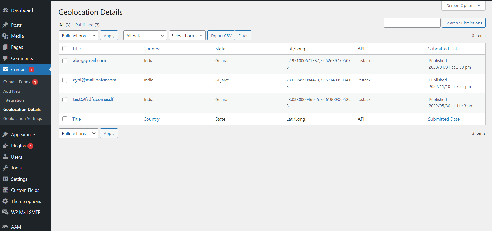

# Track Geolocation Of Users Using Contact Form 7
Track Geolocation Of Users Using Contact Form 7 allows you to get geolocation information with their form submission. This will help you know better from where the visitor has submitted the form.
Get Geolocation details including city, state, country, zip code, latitude/longitude.
Send all this information including a static Google map image in the mail with a simple shortcode.
Form a Specific Visual chart to get to know where the visitors are more.

**Features of Track Geolocation Of Users Using Contact Form 7**

- Get Geolocation details including city,state,country,zipcode,latitude/longitude.
- Send all this information including a static google map image in the mail with a simple shortcode.
- Form Specific Visual chart to get to know from where the Visitors become more.
- We have used 2 Types of API here one is with access token key named ipstack and another is without access token which is free named ipapi & KeyCDN. So if you do not enter access token key in plugin setting then it will fetch data with the help of free API keys.
- To add latitude/longitude, country, state, city in mail – [geolocation]
- To add latitude/longitude, country, state, city & Google map static image in the mail – [geolocation lat-long country state city gmap]
- To add only latitude/longitude in mail – [geolocation lat-long]
- To add only the country in the mail- [geolocation country]
- To add only the state in the mail – [geolocation state]
- To add only the city in the mail – [geolocation city]
- To add only Google map static image in the mail- [geolocation gmap]

**Note:** To add Google map static image in the mail you have to enable this 2 option
1) You have to enable Use HTML content-type in the Mail setting of Contact form 7.
2) You have to enable Maps Static API in Google Map API.

   
# Installation
1. Download the plugin zip file from WordPress.org plugin site to your desktop / PC
2. If the file is downloaded as a zip archive, extract the plugin folder to your desktop.
3. With your FTP program, upload the plugin folder to the wp-content/plugins folder in your WordPress directory online
4. Go to the Plugin screen and find the newly uploaded Plugin in the list.
5. Click ‘Activate Plugin’ to activate it.

# How To Use
You have to configure it from wp-admin > Contact > Add/Edit Contact Forms and short code added (Contact Form 7 needs to be activated before).

shows setting option to be enabled to get Google Map static image in the email.

shows all the possible options available for this plugin.

This area shows a detailed graph on the basis of submitted forms.

This is show list of all form users.

# Getting Help
If you have any difficulties while using this Plugin, please feel free to contact us at support@zealousweb.com. We also offer custom WordPress extension development and WordPress theme design services to fulfill your e-commerce objectives. Our professional dy‐ namic WordPress experts provide profound and customer-oriented development of your project within short timeframes. Thank you for choosing a Plugin developed by ZealousWeb!

