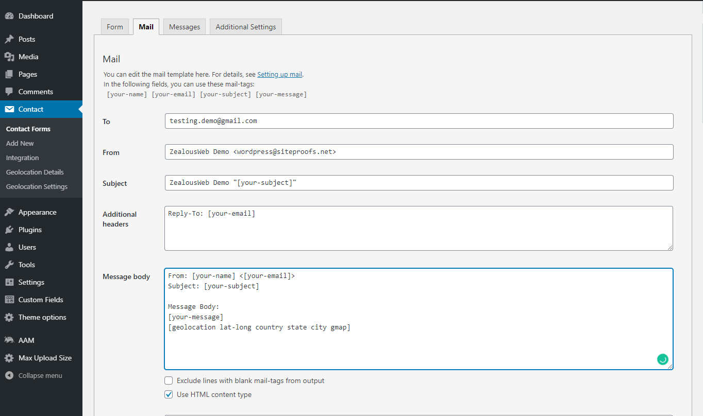
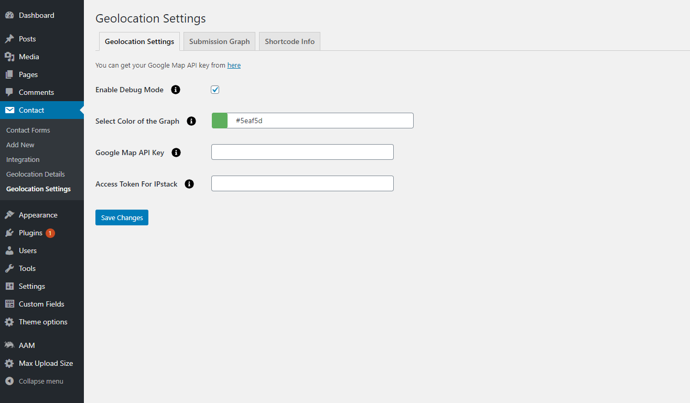
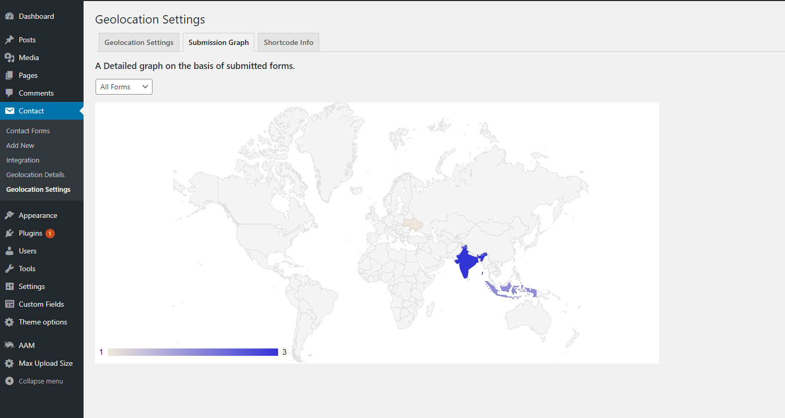

# Track Geolocation Of Users Using Contact Form 7
Track Geolocation Of Users Using Contact Form 7 allows you to get geolocation information with their form submission. This will help you know better from where the visitor has submitted the form.
Get Geolocation details including city, state, country, zip code, latitude/longitude.
Send all this information including a static Google map image in the mail with a simple shortcode.
Form a Specific Visual chart to get to know where the visitors are more.

# Installation
1. Download the plugin zip file from WordPress.org plugin site to your desktop / PC
2. If the file is downloaded as a zip archive, extract the plugin folder to your desktop.
3. With your FTP program, upload the plugin folder to the wp-content/plugins folder in your WordPress directory online
4. Go to the Plugin screen and find the newly uploaded Plugin in the list.
5. Click ‘Activate Plugin’ to activate it.

# How To Use
You have to configure it from wp-admin > Contact > Add/Edit Contact Forms (Contact Form 7 needs to be activated before).

shows setting option to be enabled to get Google Map static image in the email.

shows all the possible options available for this plugin.

This area shows a detailed graph on the basis of submitted forms.

# Getting Help
If you have any difficulties while using this Plugin, please feel free to contact us at opensource@zealousweb.com. We also offer custom WordPress extension development and WordPress theme design services to fulfill your e-commerce objectives. Our professional dy‐ namic WordPress experts provide profound and customer-oriented development of your project within short timeframes. Thank you for choosing a Plugin developed by ZealousWeb!

